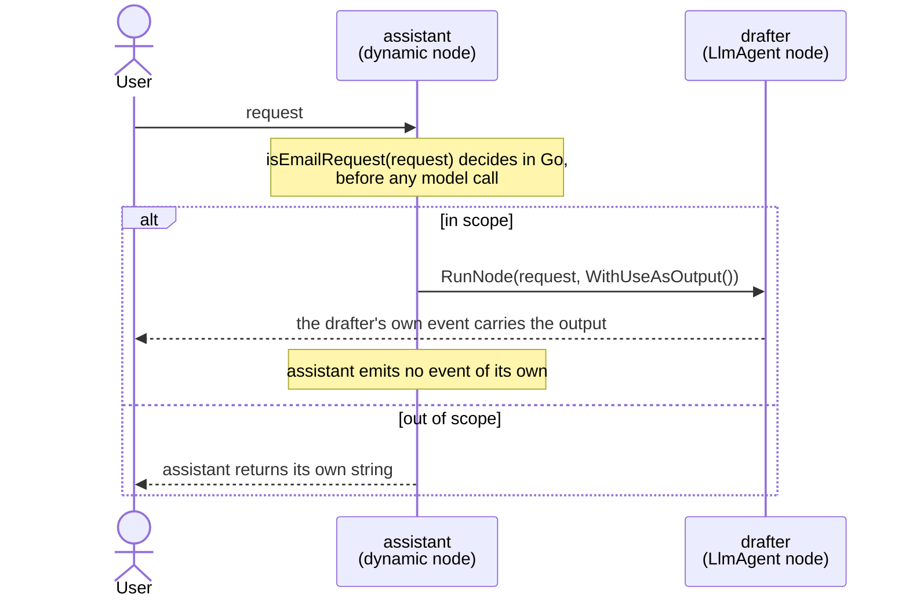

# Dynamic workflow + output delegation

A dynamic orchestrator that hands its terminal output to a child node instead
of producing one. An in-scope request is delegated to an `LlmAgent` child with
`workflow.WithUseAsOutput()`, so the agent's own event *is* the orchestrator's
output. An out-of-scope request is answered by the orchestrator itself with an
ordinary `return`.

- **Concept:** Promote a child's output to the parent dynamic node's terminal
  output with `workflow.RunNode(..., workflow.WithUseAsOutput())`.
- **Needs LLM?** Yes (Gemini). Only the delegating branch calls the model, but
  credentials are needed to start either one.

## Goal

By default a dynamic node's output is whatever its Go body returns, so
delegating to a child means capturing the child's value and returning it again.
That works, but it emits the same content twice: once on the child's event and
once on the orchestrator's terminal event.

`WithUseAsOutput()` removes the second one. The child's event is stamped as the
parent's output and the parent emits no terminal event of its own, so the
`LlmAgent` child's reply is carried by exactly one event, authored by the agent
rather than by the workflow. The console prints the reply once either way, so
the saving shows up in the event stream and not in the transcript below.

The sample puts both branches in one node so either can be exercised from the
console: type a request mentioning an email to take the delegating branch, or
anything else to take the plain-return branch.

## Authentication

The model client reads its config from the environment, so set one of:

```bash
# Option A — Gemini API key
export GOOGLE_API_KEY=...

# Option B — Vertex AI via gcloud Application Default Credentials
gcloud auth application-default login
export GOOGLE_GENAI_USE_VERTEXAI=true
export GOOGLE_CLOUD_PROJECT=your-project
export GOOGLE_CLOUD_LOCATION=your-region   # e.g. us-central1
```

The model client is built at startup, before the guard runs, so with neither set
the sample exits with `api key is required for Google AI backend` instead of
showing a prompt. That applies to the out-of-scope branch too, even though it
never calls the model.

## Workflow



The arrow back to the user is the whole point: on the delegating branch it
leaves `drafter`, not `assistant`. `assistant` is also the graph's last node —
`Start → assistant` is its only static edge, and everything else above happens
inside the orchestrator's Go body.

## Running the sample

```bash
go run ./examples/workflow/dynamic/use_as_output/ console
```

## Example session

The email wording comes from the model, so it varies between runs. Which branch
runs does not — it is decided in Go.

```text
User -> what is the weather today
Agent -> Out of scope. Ask me to draft an email.

User -> email the team that Friday standup is canceled
Agent -> Subject: Friday Standup Canceled
Hi Team,
Please note that our standup meeting this Friday is canceled.
If you have any urgent updates or blockers to share, please post them in our team channel. Otherwise, we will resume our regular schedule next week.
Have a great weekend!
Best regards,
[Your Name]
```

## What it shows

| Concept | Where |
|---|---|
| `workflow.WithUseAsOutput()` | passed to `RunNode` on the in-scope branch, promoting the drafter's output to `assistant`'s terminal output, carried on the drafter's own event |
| Delegation suppresses the parent's terminal event | the drafter's reply is emitted once, authored by `drafter`, and `assistant` emits no event of its own |
| Plain return as output | the out-of-scope branch returns a string from the body, which becomes `assistant`'s terminal output |
| Registering a wrapped agent | `SubAgents: []agent.Agent{drafterAgent}` lets the runner resolve `drafter` as the event author |

## Notes

### The delegating node is the last node in this graph

A delegated value travels on the child's event and is not recorded as the parent
node's own output, so a node chained after a delegating dynamic node receives the
zero value rather than the delegated text — silently, with no error. That is why
`assistant` has no successor here. Chaining after a plain `RunNode` behaves
normally, because there the parent emits a terminal event of its own.

### Why the branch is decided in plain Go

The guard is a substring check on the user's request, not a model call or a
length check on generated text. That keeps both branches reachable on demand, so
the run above reproduces. A guard that depends on model output would make which
branch runs vary per run, which is the wrong property for a sample whose whole
point is the difference between the two branches.

### One delegation per activation

`WithUseAsOutput()` may be used on at most one child per parent activation. A
second delegating `RunNode` call in the same body fails with
`workflow.ErrOutputAlreadyDelegated`. Delegation also chains: if the delegated
child is itself a dynamic node that delegates, the innermost child's event is
stamped for the whole ancestor chain.

### Tunable: pick a different model

Edit `gemini-3.5-flash` in `main.go` to whatever model your credentials have
access to. The drafter prompt is short and any modern Gemini model handles it.
